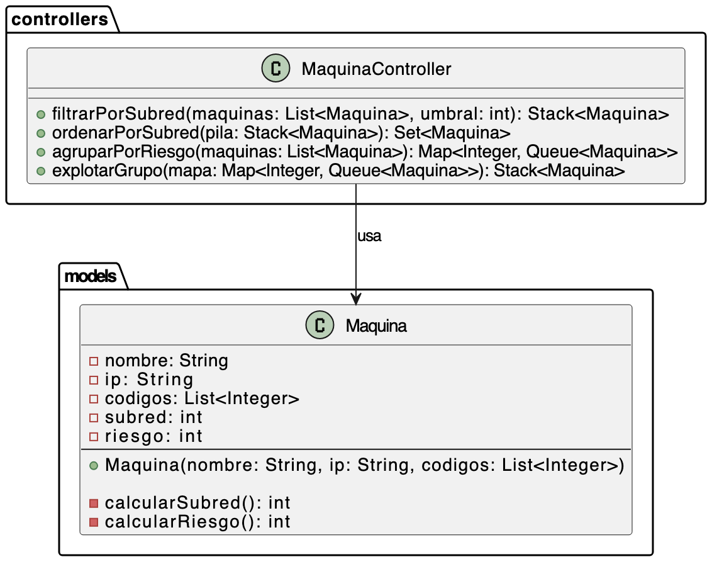

#  Examen Práctico – Clase `MaquinaController`

---

##  Descripción
En un entorno de administración de infraestructura de red, es fundamental poder filtrar, organizar y priorizar máquinas en función de características técnicas como su ubicación en la red (subred) y su nivel de riesgo operativo. El método filtrarPorSubred permite aislar máquinas que están en subredes específicas de interés, lo cual es útil para mantenimiento segmentado o análisis de zonas críticas. Posteriormente, ordenarPorSubred organiza dichas máquinas para facilitar la inspección técnica, priorizando aquellas en subredes más elevadas. Por otro lado, agruparPorRiesgo permite identificar rápidamente grupos de máquinas con niveles similares de exposición a fallos o alertas, y explotarGrupo se encarga de aislar de manera eficiente el conjunto de mayor riesgo, lo que resulta clave para tomar decisiones rápidas y asignar recursos de mitigación. Estas operaciones están encadenadas lógicamente para simular procesos reales de análisis en redes distribuidas.

##  Objetivo

Desarrollar una clase `MaquinaController` que gestione objetos de tipo `Maquina` con uso de estructuras de datos como `Stack`, `Queue`, `TreeSet` y `TreeMap`, aplicando razonamiento lógico, campos calculados y métodos encadenados.


---

##  Modelo: `Maquina`

Cada objeto `Maquina` posee los siguientes atributos:

* `nombre`: nombre de la máquina (puede contener espacios y números)
* `ip`: dirección IP en formato `"xxx.xxx.xxx.xxx"`
* `codigos`: lista de enteros

Además, contiene **dos campos calculados**:

* `subred`: el **cuarto octeto** de la IP. TIP: **split("\\\\.");**
```java
// La subred se calcula con split:
split("\\.");

// Ejemplo: "155.25.220.238" -> subred: 238
```


* `riesgo`: suma de códigos divisibles por 3 multiplicado por el número de caracteres únicos del nombre (sin espacios)

> Revisa ejemplos detallados en 👉 [📄 MaquinaModeloejemplo.md](MaquinaModeloejemplo.md)

---

##  Clase a implementar: `MaquinaController`

### Método A – `filtrarPorSubred(List<Maquina> maquinas, int umbral)`

* Retorna un `Stack<Maquina>`
* Filtra las máquinas con `subred < umbral`
* Mantiene el orden original en que aparecen

---

### Método B – `ordenarPorSubred(Stack<Maquina> pila)`

* Recibe la pila generada en A
* Devuelve un `TreeSet<Maquina>` ordenado por:

  * `subred` ascendente
  * `nombre` ascendente
* Si nombre y subred son iguales, se considera duplicado y se descarta

---

### Método C – `agruparPorRiesgo(List<Maquina> maquinas)`

* Retorna un `TreeMap<Integer, Queue<Maquina>>`
* Agrupa las máquinas por el campo `riesgo`
* El orden del mapa es ascendente según el valor del riesgo

---

### Método D – `explotarGrupo(Map<Integer, Queue<Maquina>> mapa)`

* Encuentra el grupo con **mayor cantidad de máquinas**
* Si hay empate, selecciona el que tenga **mayor riesgo**
* Retorna un `Stack<Maquina>` con las máquinas de ese grupo en orden **LIFO**

---

> Revisa los ejemplos de ejecución esperada (entradas/salidas para cada método) en 👉 [📄 MaquinaControllerEjemplos.md](MaquinaControllerEjemplos.md)

---

##  Implementación y validación

Para validar tu implementación se ejecutarán pruebas unitarias sobre:

* Métodos A, B, C, D
* Cálculo de `subred` y `riesgo`

---

##  RÚBRICA DE EVALUACIÓN (9 puntos)

| **Componente Evaluado**          | **Descripción**                                                                                                | **Puntos** |
| -------------------------------- | -------------------------------------------------------------------------------------------------------------- | ---------- |
| ✅ Campo calculado: `subred`      | Extrae correctamente el tercer octeto de la IP                                                                 |  1.5        |
| ✅ Campo calculado: `riesgo`      | Suma códigos divisibles por 5 y multiplica por caracteres únicos del nombre (sin espacios)                     |  1.5        |
| 🔷 Método A – `filtrarPorSubred` | Filtra correctamente y mantiene orden de entrada                                                               | 1.5        |
| 🔷 Método B – `ordenarPorSubred` | Ordena por subred DESC, luego nombre ASC. Elimina duplicados por subred y nombre                               |  1.5        |
| 🔷 Método C – `agruparPorRiesgo` | Agrupa correctamente en TreeMap con Queue por riesgo                                                           | 1.5        |
| 🔷 Método D – `explotarGrupo`    | Identifica correctamente el grupo más numeroso y, en caso de empate, el de mayor riesgo. Invierte orden a LIFO |  1.5       |
| **Total**                        |                                                                                                                | **9.0**    |

javac --release 17 -cp "lib/*" -d bin src/validaciones/ValidacionesMaquina.java src/models/Maquina.java
jar cf lib/validadores-evaluacion.jar -C bin validaciones -C bin models
jar tf lib/validadores-evaluacion.jar